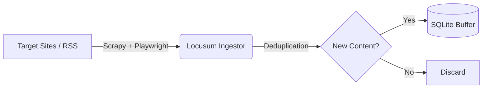

# LocuSum Ingestor Architecture

## 1. Overview
**LocuSum Ingestor**는 로컬 뉴스 및 커뮤니티 콘텐츠를 수집(Crawling)하여 원본 데이터(Raw HTML)를 버퍼 데이터베이스에 저장하는 **Ingestion Layer**입니다.
이 모듈은 전체 LocuSum 파이프라인의 첫 번째 단계로, 수집된 데이터는 이후 Enricher 및 Embedding Service를 통해 처리되어 최종적으로 PostgreSQL에 저장됩니다.

## 2. System Architecture

### 2.1 High-Level Flow


### 2.2 Core Components
- **Crawler Engine**: `Scrapy` 프레임워크를 기반으로 하며, `scrapy-playwright`를 사용하여 동적 콘텐츠(JavaScript 렌더링)를 처리합니다.
- **Storage (Buffer)**: `SQLite` (`locusum_buffer.db`)를 사용하여 MVP 단계의 데이터 버퍼링을 담당합니다. `SQLModel` (SQLAlchemy Wrapper)을 통해 ORM으로 관리됩니다.
- **Deduplication**: URL의 SHA-256 해시를 Primary Key로 사용하여 **멱등성(Idempotency)**을 보장합니다. 이미 수집된 URL은 파이프라인 단계에서 중복 제거됩니다.

## 3. Project Structure
소스 코드는 `locusum_ingestor` 패키지 내부에 모듈화되어 있습니다.

```
locusum-Ingestor/
├── locusum_ingestor/       # Main Package
│   ├── __init__.py
│   ├── main.py             # Entry Point (CLI)
│   ├── database.py         # Database Connection & Schema
│   ├── items.py            # Data Models
│   ├── pipelines.py        # Data Processing & Storage
│   ├── settings.py         # Configuration
│   └── spiders/            # Spider Definitions
│       └── news_spider.py  # Generic News Spider
├── scrapy.cfg              # Scrapy Project Config
├── pyproject.toml          # Dependencies
└── docs/                   # Documentation
```

## 4. Data Model (SQLite)

### `raw_articles` Table
수집된 원본 데이터를 저장하는 테이블입니다.

| Column | Type | Description |
|--------|------|-------------|
| `id` | TEXT (PK) | URL의 SHA-256 해시 |
| `url` | TEXT (Unique) | 원본 URL |
| `source` | TEXT | 출처 (예: 도메인, RSS 피드명) |
| `title` | TEXT | 기사 제목 |
| `html_content` | TEXT | 원본 HTML 내용 |
| `fetched_at` | DATETIME | 수집 시각 (UTC) |
| `status` | TEXT | 처리 상태 (Default: "NEW") |

## 5. Implementation Details

### 5.1 Crawling Strategy
- **Entry Point**: `main.py`를 통해 실행되며, 타겟 URL과 CSS 선택자를 인자로 받아 동적으로 스파이더를 구성할 수 있습니다.
- **Dynamic Rendering**: `Playwright`를 통합하여 SPA(Single Page Application)나 Lazy Loading이 적용된 뉴스 사이트도 완벽하게 수집합니다.
- **Robots.txt**: `ROBOTSTXT_OBEY = True` 설정을 통해 타겟 사이트의 크롤링 정책을 준수합니다.

### 5.2 Pipeline Logic (`pipelines.py`)
1. **Hash Calculation**: 수집된 Item의 URL을 SHA-256으로 해싱합니다.
2. **Existence Check**: DB에서 해당 해시 ID가 존재하는지 조회합니다.
3. **Save or Drop**:
   - 존재하지 않으면: DB에 저장하고 로그를 남깁니다.
   - 존재하면: `DropItem` 예외를 발생시켜 중복 저장을 방지합니다.

## 6. Future Roadmap (Post-MVP)

### 6.1 Scalability (Redis Streams)
현재의 SQLite 파일 기반 버퍼는 단일 인스턴스에 적합합니다. 향후 수평 확장을 위해 **Redis Streams** 도입을 고려할 수 있습니다.
- **Crawler** -> **Redis Stream** (`stream.raw`)
- **Enricher** (Consumer Group) -> **Redis Stream** -> **PostgreSQL**

### 6.2 API Integration
현재는 CLI/Script 형태이지만, 추후 운영 편의성을 위해 `FastAPI`를 래핑하여 외부에서 크롤링을 트리거하거나 상태를 모니터링하는 API 서버를 구축할 수 있습니다.
